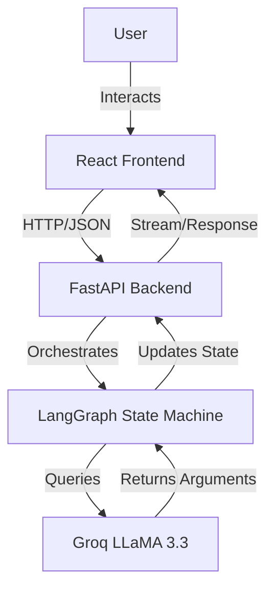

# 🏗️ Architecture Documentation

## System Overview

DebateBot is built on a modern, decoupled architecture separating the user interface from the complex logic of debate generation.



## Component Details

### 1. Frontend (Client-Side)
- **Technology**: React 18, Vite
- **Responsibility**: 
  - Renders the interactive UI.
  - Manages local state (user inputs, current debate stage).
  - Visualizes arguments with animations.
  - Handles API communication via proxy.
- **Key Components**:
  - `DebateArena`: The main container for the debate view.
  - `Scoring`: Visualizes the argument scores.
  - `LiveDebateArena`: Manages the interactive user-vs-AI mode.

### 2. Backend (Server-Side)
- **Technology**: Python 3.12, FastAPI
- **Responsibility**:
  - Exposes RESTful API endpoints.
  - Validates incoming requests using Pydantic models.
  - Manages CORS and security.
  - **LangGraph Integration**: The core logic resides here. It defines the "nodes" (Opening, Rebuttal, Closing) and "edges" (transitions) of the debate flow.

### 3. AI Logic (Intelligence Layer)
- **Technology**: LangChain, Groq API (LLaMA 3.3 70B)
- **Responsibility**:
  - **Contextual Understanding**: Analyzes the topic and previous arguments.
  - **Argument Generation**: Produces structured text for specific debate stages.
  - **Scoring & Feedback**: Evaluates arguments based on rubrics (coherence, evidence, etc.).

## Data Flow

1.  **Initiation**: User submits a topic (e.g., "AI is dangerous").
2.  **Orchestration**:
    *   `POST /api/debate` triggers the `graph.py` workflow.
    *   **Node 1 (Opening)**: LLM generates opening statements for Prop and Opp.
    *   **Node 2 (Rebuttal)**: LLM reads the opponent's opening and generates a counter.
    *   **Node 3 (Closing)**: LLM synthesizes everything into a final statement.
3.  **Delivery**: The full structured JSON object (containing all stages for both sides) is returned to the frontend.

## Directory Structure

```
DebateBot/
├── backend/                # FastAPI Application
│   ├── main.py            # API Routes & Config
│   ├── graph.py           # LangGraph Definitions
│   └── requirements.txt   # Python Dependencies
├── frontend/               # React Application
│   ├── src/               # Source Code
│   │   ├── components/    # Reusable UI Components
│   │   └── App.jsx        # Root Component
│   ├── vite.config.js     # Build Configuration
│   └── package.json       # Node Dependencies
├── docs/                   # Documentation (You are here)
└── actions files...
```
