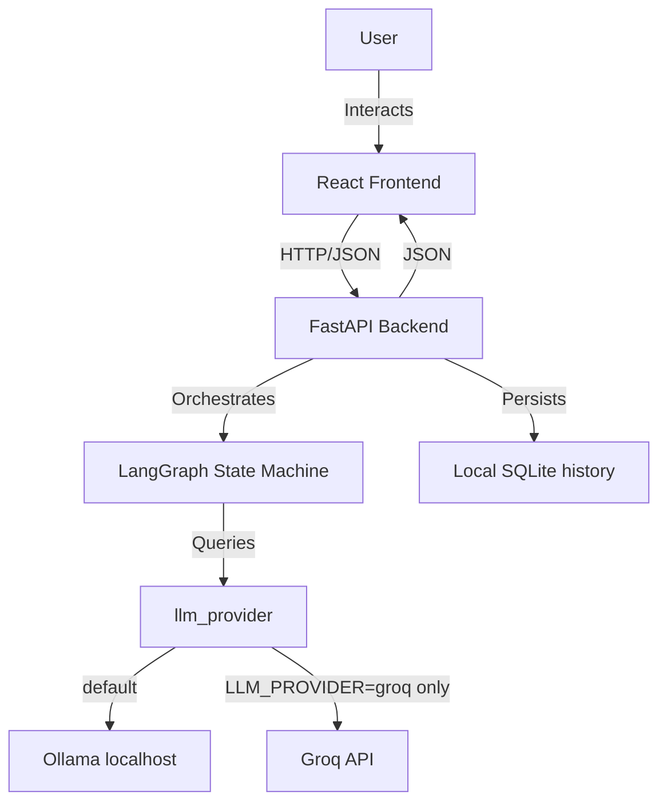

# Architecture Documentation

## System Overview

Spar with a Friend (DebateBot) separates the React UI from a FastAPI + LangGraph backend. The **default** LLM path is local Ollama; Groq is an explicit opt-in only.


```mermaid
graph TD
    User[User] -->|Interacts| Frontend[React Frontend]
    Frontend -->|HTTP/JSON| Backend[FastAPI Backend]
    Backend -->|Orchestrates| Graph[LangGraph State Machine]
    Graph -->|Queries| Provider[llm_provider]
    Provider -->|default| Ollama[Ollama localhost]
    Provider -->|LLM_PROVIDER=groq only| Groq[Groq API]
    Backend -->|Persists| SQLite[Local SQLite history]
    Backend -->|JSON| Frontend
```

## Component Details

### 1. Frontend (Client-Side)
- **Technology**: React 18, Vite
- **Responsibility**:
  - Practice setup (provider badge, tone, difficulty, presets)
  - Live Arena, dual-AI debate view, scoring
  - Shows Local · Ollama badge and Ollama setup checklist on 503
- **Key Components**:
  - `PracticeSetup`: default friend-mode entry
  - `LiveDebateArena`: user-vs-AI with end-of-round report
  - `DebateArena` / `Scoring`: classic DebateBot tools

### 2. Backend (Server-Side)
- **Technology**: Python 3.12, FastAPI
- **Responsibility**:
  - REST endpoints (`/api/debate`, `/api/live-counter`, `/api/round-report`, `/api/status`, …)
  - LangGraph graphs in `graph.py`
  - Coaching presets in `coaching.py`
  - Provider abstraction in `llm_provider.py`

### 3. AI Logic
- **Primary**: Ollama + open-weight `llama3.2:3b` (local inference)
- **Harness**: LangGraph nodes for debate stages, live counter, and report
- **Optional**: Groq LLaMA 3.3 when `LLM_PROVIDER=groq` — never a silent fallback

## Data Flow

1. User opens Practice setup → `GET /api/status` + `/api/presets`
2. Live Arena turn → `POST /api/live-counter` → `live_graph` → Ollama
3. Finish round → `POST /api/round-report` → report node → SQLite
4. Dual-AI debate → `POST /api/debate` → six-node `debate_graph`

## Directory Structure

```
DebateBot/
├── backend/
│   ├── main.py            # API routes
│   ├── graph.py           # LangGraph definitions (edit prompts here)
│   ├── llm_provider.py    # Ollama / Groq abstraction
│   ├── coaching.py        # Friend mode presets & tone
│   ├── history.py         # SQLite sessions
│   └── requirements.txt
├── frontend/
│   └── src/components/
├── scripts/smoke_local.py
├── SUBMISSION.md
└── docs/
```
